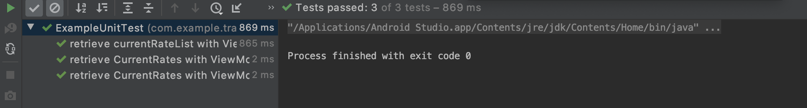
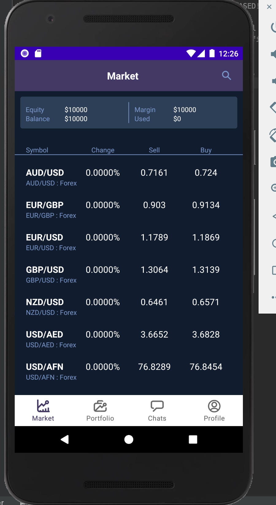
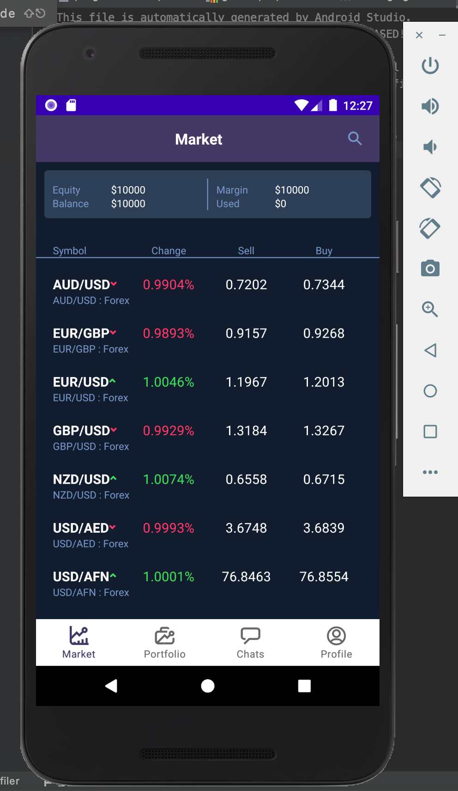

# TradingExample

<p align="left">
  <a href="https://android-arsenal.com/api?level=21"></a>
</p>

Trading Example is a example application for current rate trading.

## Tech stack & Open-source libraries
- Minimum SDK level 21
- Kotlin based and using coroutines for asynchronous.
- JetPack
  - LiveData - notify domain layer data to views.
  - ViewModel - UI related data holder, lifecycle aware.
- Architecture
  - MVVM Architecture (ViewModel + Model)
  - Repository pattern
- Material Design
- Retrofit2 & Gson - constructing the REST API
- OkHttp3 - implementing interceptor, logging and mocking web server

## Open API

TradingExample is using the [FreeForex](https://www.freeforexapi.com/Home/Api) to constructing RESTful API.<br>
FreeForex provides a RESTful API interface more than 100+ lines of data related to current rate

A sample request looks like this:
```json
//Request
https://www.freeforexapi.com/api/live?pairs=EURUSD

//Response
{
    "rates":{
        "EURUSD":{
            "rate":1.170228,
            "timestamp":1532428704963}
        },
    "code":200
}
```

## Current Rate Model
The model class is a simple pojo, which store the properties of current rate.
```kotlin
/**
 * This service is based on the free forex api
 * https://www.freeforexapi.com/api/
 */
interface ServicesApiInterface {
    @GET("live")
    fun currentRates(@Query("pairs") name: String): Call<CurrentRateResponse>
}
```

## Retrofit
```kotlin
/**
 * This service is based on the free forex api
 * https://www.freeforexapi.com/api/
 */
interface ServicesApiInterface {
    @GET("live")
    fun currentRates(@Query("pairs") name: String): Call<CurrentRateResponse>
}
```

## Repository
```kotlin
interface CurrentRateDataSource {
    fun retrieveCurrentRates(name: Array<String>, callback: OperationCallback<CurrentRate?>)
    fun cancel()
}
```


## Unit Tests 
verify the interactions of viewmodels between repositories and dao & REST api requests.


## screenshot


